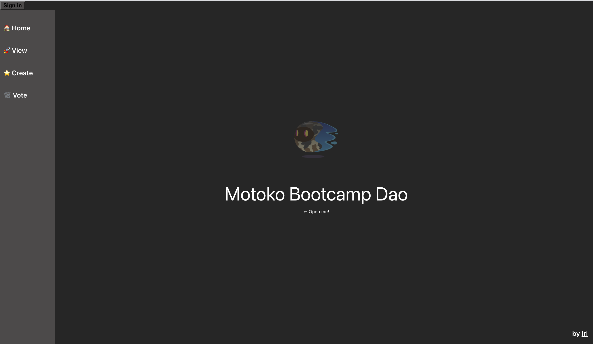

# 👻 Motoko Bootcamp 2023 

A huge thanks to [Iri](https://twitter.com/iriasviel) (ex-Motoko Bootcamp student | Motoko dev at Finterest) for contributing to the core project. 
You can use this repository as a starter point for your the [core project](https://github.com/motoko-bootcamp/motokobootcamp-2023) of [Motoko Bootcamp 2023](https://github.com/motoko-bootcamp/motokobootcamp-2023).

<p align="center">  </p>
<p align="center">To see the navigation bar hover on the left.</p>

A few more things:
- To build the core project you should complete the code that of the [dao]() canister & [webpage]() canister.
- Using this skeleton is NOT a requirement. This repository is only meant to help you get started. 
- The core project has to be submitted before the deadline - more infos on #submit.
- [Plug wallet is used] and we recommend to use it for this core project to make your life easier: mainly because **Principal** for users will be the same between canisters. THIS IS NOT THE CASE WITH INTERNET IDENTITY WHICH WILL MAKE YOUR LIFE WAY HARDER.

- There are some bugs and errors that can appear - the code has been quickly hacked to help you get on track and focus on Motoko but this is not a perfect example.
- I haven't been able to set up the local environment - it doesn't seem to work, the error message is not helping at all and the Plug documentation is quite empty on that subjet ... since you'll have to deploy your project on the IC just go ahead and deploy on the IC. If you make it work locally please feel free to PR that'll help everyone. 

## Instructions to deploy 
Install the necessary packages.
```
npm run install
```
Deploy on the IC 
```
dfx deploy --network ic
```

## Live demo

There are 2 versions of this app deployed on the IC. 

- This example (without the backend completed so any request will fail): https://raisq-jyaaa-aaaaj-qazrq-cai.ic0.app/
- Completed version (with the backend completed): https://xmfll-uyaaa-aaaah-ab2ja-cai.ic0.app/ 

