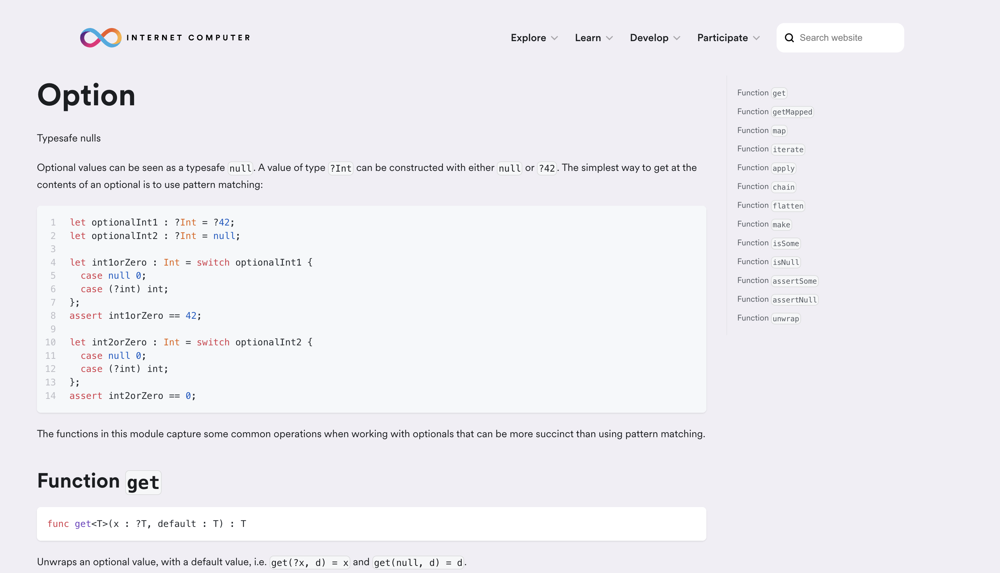
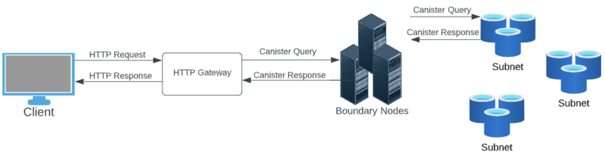
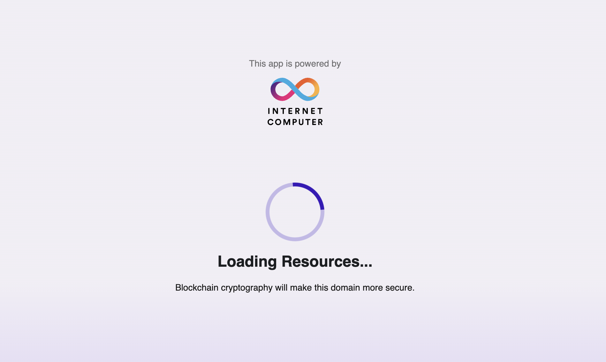
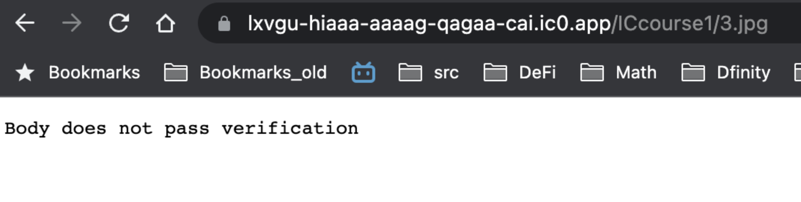
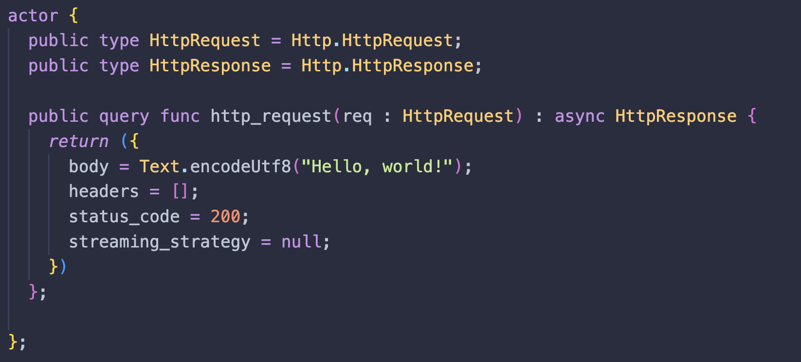
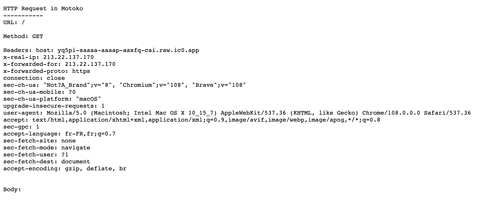
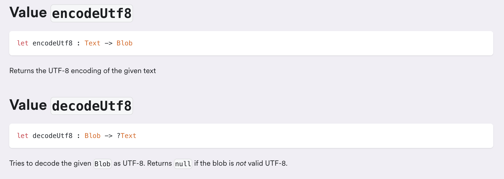
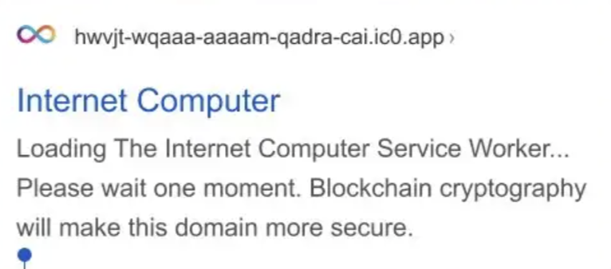
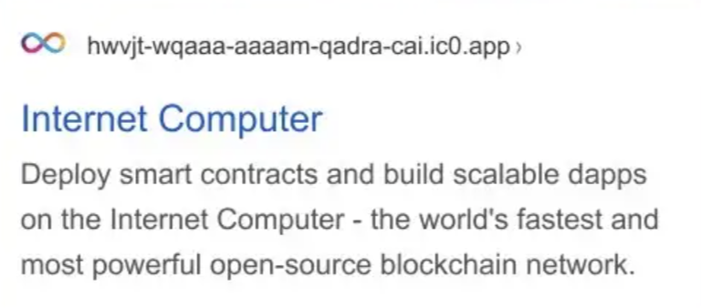

# Day 3 🐥
Welcome to Day 3 of the Motoko Bootcamp! <br/> We hope you're feeling like a coding ninja ready to take on even more advanced topics. Today, we'll be diving into HTTP requests in Motoko and learning how to interact with canisters from a front end using the JavaScript Agent. You'll also learn about pattern matching and variants in Motoko, which will give you the power to control your code! <br/>
In addition, we'll also be introducing data structures such as HashMap/TrieMap and CRUD operations. These data structures will be really useful when working on the [core project](../../core_project/PROJECT.md). <br/>

Don't hesitate to ask for help from your teammates or mentors if you need it. Remember, we're all here to learn, laugh, and support each other. 😉
# 🍿 Lectures 
- **Frontend: interacting with your canister using JavaScript (Identity, Agent, Actor).** <br/>
In this lecture, you'll learn how you can interact with your canisters from a webpage using JavaScript. This is extremely useful as this is the way most users interact with dApps. You'll learn about fundamental concepts such as Identity, Agent, or Actor and how to use them.

- **Motoko: Custom type, variants, pattern matching & Result type.** <br/>
In this lecture, you'll learn how you can create your custom types giving you the ability to represent data in the way that best suits your program - how to handle variants that allow you to define different cases and combine them with pattern matching. Finally, you'll learn about the **Result** type in Motoko. Learn to create your own types, handle errors, match patterns and make your code more efficient, readable, and maintainable.

- **Motoko: HashMap, TrieMap & CRUD.** <br/>
In this lecture, you'll learn how to use these powerful data structures and how to perform CRUD operations on canisters. CRUD stands for Create, Read, Update and Delete; those are basic operations that can be performed on a database, and are used to manage data in persistent storage. This will be crucial for working on the core project.

# 🧩 Motoko: Optional and Generic types & High order functions.
## 🫙 Optional type 
In Motoko, like in many other programming languages, there is a special value called "null" that represents the absence of a result. This is useful when indicating that a function will return nothing. The value null is of type **Null** (and the type **Null** contains only one value: null). <br/> For example, imagine that you have an array of names called "**names**" and a function called "**find_name**" that takes a list of names as input and returns the first index such that the name is in the array at that index. If the name is not found, the function should return "null" instead of an index. This way, the function indicates that it did not find the name, rather than producing an error! 

If we write the following:
```
let names : [Text] = ["Motoko", "Rust", "JavaScript", "TypeScript"];
public func find_name(name : Text) : async Nat {
    var index : Nat = 0;
    for(language in names.vals()){
        if (language == name){
            return index;
        };
        index +=1;
    };
    return null; // We haven't found any match so we return null.
};
```
This declaration is not valid - Motoko will throw the following error:
```
type error [M0050], literal of type
  Null
does not have the expected type
  Nat
```
This is because "null" is not of type **Nat**. 
To indicate that a function may return either a **Nat** value or "null", we need a way to express that the function's return type can be one of two possibilities. This is because the specific return value of the function depends on the input that we don't know in advance, so we can't predict if the function will return a **Nat** or "null" until it is executed. <br/>

To express that we can use an **optional type**: "**?T**". 
In our case, we would use "**?Nat**". We can rewrite our code using this new notation:
```
let names : [Text] = ["Motoko", "Rust", "JavaScript", "TypeScript"];
public func find_name(name : Text) : async ?Nat {
    var index : Nat = 0;
    for(language in names.vals()){
        if (language == name){
            return ?index;
        };
        index +=1;
    };
    return null; // We haven't found any match so we return null.
};
```

> The optional type indicated by ? can be used with any other type and is not limited to **Nat**. We can have **?Text**, **?Int**, **?Bool** and more...

The "optional" type is often used in conjunction with the "switch/case" pattern in Motoko. This pattern allows you to handle an optional value and execute different parts of your code depending on whether the input value is "null" or not. In other words, you can use the "switch/case" pattern to check if an optional value is present or not, and then perform different actions based on that. This allows for more elegant and safer code as it allows you to handle the case where the input is null and avoid any unexpected behavior.

```
public func handle_null_value(n : ?Nat) : async Text {
    switch(n) {
        // Check if n is null 
        case(null){
            return ("The argument is null"); 
        };
        case(? something){
            return ("The argument is : " # Nat.toText(something));
        };
    };
};
```

A final word on the optional type - there is a module from the Base library called [Option](https://internetcomputer.org/docs/current/developer-docs/build/cdks/motoko-dfinity/base/Option). This module allows you to perform operations on optional values. 

<p align="center">  </p>

For instance,  you can use the "**Option.get**" function to unwrap an optional value with a default value - as in the following:
```
import Option "mo:base/Option";
actor {

    public func always_return_a_nat(n : ?Nat) : async Nat {
        return(Option.get(n, 0))
    };

}
```

This function will take a **?Nat** as input and return a **Nat**. If you provide a **Nat** as input it will return the same - but if you provide "**null**" it will return the default value - which is set to 0.

For instance, assuming that you've deployed the actor on your local replica (and called the canister "**example**"):
```
dfx canister call example always_return_a_nat '(opt 2)'
```
Will return:
```
(2 : nat)
```
Whereas the following:
```
dfx canister call example always_return_a_nat '(null)'
```
Will return:
```
(0 : nat)
```
## 👤 Generic Type
In the previous section, we briefly introduced the concept of "**generic type**" with the notation "**?T**". Now, let's dive deeper and explore the exciting world of generics.

A generic type, usually written as "T", allows you to write functions and code that can adapt to different types. When we talk about "**T**" in programming, it refers to "whatever type you want".
This means that you can create a single function or class that can handle multiple types of inputs or data, without having to write separate code for each type.

Let's imagine we have a task at hand - to determine if the size of an array is even or not. We're going to write a function called "**is_array_size_even**" that takes an array as an input and returns a Boolean value indicating whether the size of that array is even or not.

One way to accomplish this is to write something like this:
```
public func is_array_size_even(array : [Nat]) : async Bool {
    let size = array.size();
    if(size % 2 == 0){
        return true;
    } else {
        return false;
    };
};
```
This function works as intended, but it's limited to arrays filled with **Nat**. So, what if we want to check the size of an array filled with **Text** or **Int**?

One approach would be to create a separate function for each possible type of array, like "**_is_array_size_even_nat**", "**_is_array_size_even_text**", "**_is_array_size_even_int**". But as you can imagine, this quickly becomes hard to manage and maintain.

A better solution is to utilize the power of generics. With generics, we can write a single function that works for any type of array. It's a more elegant and efficient way to solve the problem. So, let's embrace our new friend - generics - and make our code more dynamic and flexible!
```
func is_array_size_even<T>(array : [T]) : Bool {
    let size = array.size();
    if(size % 2 == 0){
        return true;
    } else {
        return false;
    };
};
```

>Notice the "**\<T>**" following the name of the function. It means that this function now depends on the type of T.

When using the "**array_size**" function, it's important to remember that you'll need to specify the type of array you're using it on. 
```
func is_array_size_even<T>(array : [T]) : Bool {
    let size = array.size();
    if(size % 2 == 0){
        return true;
    } else {
        return false;
    };
};

let array : [Nat] = [1,2,3,4];
let bool : Boolean = is_array_size_even<Nat>(array); // Replace T with the actual type when you use the function. 
```

## 🏋️ Higher Order Functions 
So far, all the functions that we have written take "simple" arguments (**Nat**, **Text**, **Char**, ...) but functions can also take other functions as arguments! Such functions are called **Higher Order Functions** and they are versatile and powerful functions that can adapt to a lot of situations. Let's unlock the power of **Higher Order Functions** in Motoko!

The [Array module](https://internetcomputer.org/docs/current/developer-docs/build/cdks/motoko-dfinity/base/Array) in particular contains several higher-order functions - that's why we will use it as a source of examples for this section. 


- [Find](https://internetcomputer.org/docs/current/developer-docs/build/cdks/motoko-dfinity/base/Array#function-find): this function will look at each element in the array one by one, and use the "predicate" (a separate function or statement) to decide if it is true or false. When the predicate returns true for a particular element, the function will return that element. If none of the elements make the predicate return true, the function will return "null" (nothing/no value). 
    <p align="center">  </p>

    We can use this function as in the following:
    ```
    import Array "mo:base/Array";
    actor {
        let f = func (n : Nat) : Bool {
            if (n == 10) {
                return true
            } else {
                return false
            };
        };

        public func mystere(array : [Nat]) : async ?Nat {
            return(Array.find<Nat>(array, f));
        };
    
    };
    ```
    > This code sample makes use of the 3 new concepts we've discussed today: Optional type, Generic type, and higher-order functions. 
    <details>
        <summary > 🤔 What do you think <strong> mystere([8,4,5,18,0,2,3]) </strong> will return ? </summary>
        It should return the first value that is equal to 10 in the array. Since there is none it will return <strong> null </strong>.
    </details>

- Filter: this function will take an array, and for every element in that array, it will use the "predicate" (a separate function or statement) to decide if it is true or false. If the predicate returns true for a particular element, that element will be included in the new array, otherwise, it will be skipped. The function will create a new array containing only the elements that passed the predicate test.
    <p align="center">  </p>

    We can use this function as in the following:
    ```
    import Array "mo:base/Array";
    actor {
        let f = func (n : Nat) : Bool {
            if (n < 10) {
                return true
            } else {
                return false
            };
        };

        public func surprise(array : [Nat]) : async ?Nat {
            return(Array.filter<Nat>(array, f));
        };
    };
    ```
    <details>
        <summary > 🤔 What do you think <strong> surprise([1, 30, 8, 12, 129, 2]) </strong> will return ? </summary>
       An array where only values below 10 are kept (the order is not modified)  : <strong> [1, 8, 2] </strong>.
    </details>

- Map: this function will take an array and a function 'f' that maps the elements of the array of type X to another type Y. This function will apply this function to each element in the original array and create a new array with the result of the function f applied to each element. The new array will have the same order as the original array.
    <p align="center">  </p>

    We can use this function as in the following:
    ```
    import Array "mo:base/Array";
    actor {
        let f = func (n : Nat) : Nat {
            return(n + 1);
        };

        public func riddle(array : [Nat]) : async [Nat] {
            return(Array.map<Nat, Nat>(array, f));
        };
    };
    ```
    <details>
         <summary > 🤔 What do you think riddle <strong> ([1, 2, 3, 4]) </strong> will return? 
         </summary>
          An array where all values have been increased by one (the order is not modified)  : <strong> [2, 3, 4, 5] </strong>.
    </details>

Sometimes it's useful to give names to functions to reuse them later - you can use variables to store functions as you can do with any other type.

```
let f = func (x : Nat) : Nat {
  return(x + x) 
}
```

# 🧩 Motoko: HTTP Requests
##  Prerequisites
If you are not familiar with HTTP, make sure to [watch this video](https://www.youtube.com/watch?v=iYM2zFP3Zn0) before reading further. 

## 👍 HTTP request vs HTPP outcalls
In this module, we will cover how canisters can be accessed through HTTP requests. This is a separate topic from the "HTTP Outcalls" lecture, which is planned for Day 5.

**HTTP Request**: Canisters can handle incoming requests and serve web pages. <br/>
**HTTP Outcalls**: Canisters can send requests and communicate with the Web 2.0 world. This can be used for various use cases, such as querying an exchange for token prices, getting the latest weather information, and sending notifications to users.

## 🌍 Accessing a canister through a browser 
Whenever you [access a canister](https://wujxq-qqaaa-aaaaj-qazca-cai.raw.ic0.app/) through your browser there are a few steps involved. Let's go through all of them.<br/>
You will notice that URLs on the Internet Computer are of the following form: 
**<CANISTER_ID>.ic0.app**
The **.ic0.app** indicates that you are reaching out to [boundary nodes](). 
## What are boundary nodes?
Canisters are hosted in the nodes that participate in the IC consensus. However, those nodes are not directly accessible by end users. <br/>
To protect the consensus nodes & improve performance there is a layer of **boundary nodes** which serve different useful purposes:

- Translate the HTTP request of the user's browser to canister call. This part is called the [HTTP Gateway](https://internetcomputer.org/docs/current/references/ic-interface-spec/#http-gateway) protocol. When canisters send their response the gateway will convert it back to an HTTP request.
- Route the calls to the correct subnet running the canister. To properly route those calls the boundary nodes have to keep track of the entire configuration of the Internet Computer: 
    - List of subnets.
    - List of nodes and which subnet they belong to.
    - The canisters run by each subnet. 
- Load balancing among the subnet's replica nodes (i.e if a replica is lacking behind and has already a lot of work on its plate - boundary nodes will send the request to another replica).
- Protect subnets from DDoS attacks.

<i> Currently, boundary nodes are run by the DFINITY Foundation. However, the objective (as part of the roadmap) is to have anyone able to set up and run a boundary nodes. This will make interaction with the Internet Computer more reactive for end users and this will make the platform more robust to censorship. You can read more in [the dedicated topic](https://forum.dfinity.org/t/boundary-node-roadmap/15562) if you are interested. </i>

<p align="center">  </p>

## 📦 Asset canister
To serve web content on the Internet Computer, a canister should have a method that can handle an http request, which includes the URL, http method, and headers, and produce an HTTP response, consisting of a status, headers, and body. There are two ways to go about that:

- Implement the http_request method and all associated logic yourself (in Motoko). This is what will be doing for our **webpage** canister.
- Use the provided **asset** canister: this is a special canister whose code has been already implemented by DFINITY. You need to specify the type of this canister in dfx.json & add the source folder of your web app. Once the asset canister is deployed on the Internet Computer the website can be accessed at http://<canister id>.ic0.app and http://<canister id>.raw.ic0.app. This is what we will use for our **interface** canister. The frontend canister that is shipped when you deploy a project with `dfx new <project>` is an asset canister (as you can confirm by looking at `dfx.json`).

You can access [the source code for this canister written in Rust](https://github.com/dfinity/sdk/tree/master/src/canisters/frontend/ic-frontend-canister) under the [DFINITY organization](https://github.com/dfinity).  

## 🔑 ic0.app vs raw.ic0.app
As we said earlier there are two ways to access a canister:
- ic0.app
- raw.ic0.app

What is the difference?

The **raw** URL will simply return the request as it is so serves the asset files (HTML, CSS, Javascript).
On the other hand, when hitting ic0.app the boundary node will first return a **service worker**. This is what is loading whenever you see this page:

<p align="center">  </p>

Once the [service worker](https://www.npmjs.com/package/@dfinity/service-worker) is installed the request is handled by the service worker. The huge advantage of the service worker is that it will verify the content that is served by the node. In that case, the content of the assets served is signed directly by the canister (under the public key on the IC) - the service worker knows the public key and is responsible for verifying the received content matches the signature. 

>  Accessing a webpage should be fast, so we use query calls to handle that. However, query calls do not go through consensus and cannot create signatures. To solve this issue, we use certified variables. This means that the content must be certified before the call happens, which can cause problems for some content. If the certification is not possible and you are accessing under ic0.app, you may encounter an error page.

<p align="center">  </p>

<p align="center" > In that case you should access under raw.ic0.app to avoid the issue.</p>


> One last thing: the service worker received when accessing **ic0.app** could in theory be faked or manipulated to certify invalid responses. Most users won't go through the trouble of verifying the service worker that is served to them. The way to solve this would be to have the public key of the Internet Computer directly shipped into the hardware or the browser. **That would be pretty dope!**  

## 🤙 Contacting the canister.
Once the boundary node has received the request. It will encode it into Candid and automatically call the``` http_request``` method of the canister.
reachable by browsers, you need to implement an ``http_request``method as part of the public interface of your actor!

<p align="center">  </p>

<p align="center" > This is the minimum code needed to return a simple page that prints <b>Hello world</b>.</p>

<p align="center">  </p>

<p align="center"> What will show up in your browser.</p>

## 🔧 Custom types 
You may have noticed a few types in the Motoko code shown earlier. 
```HttpRequest```and ```HttpResponse```. Those types have been defined in an external file called ``http.mo``. 

>It is a recommended practice to create custom types and their associated methods in a separate file for organization, clarity, and reusability.

Let's go through this file together. Here is the content:
```
module Http {
    public type HeaderField = (Text, Text);

    public type HttpRequest = {
        body: Blob;
        headers: [HeaderField];
        method: Text;
        url: Text;
    };

    public type HttpResponse = {
        body: Blob;
        headers: [HeaderField];
        status_code: Nat16;
        streaming_strategy: ?StreamingStrategy;
    };

    public type StreamingStrategy = {
        #Callback: {
            callback : StreamingCallback;
            token    : StreamingCallbackToken;
        };
    };

    public type StreamingCallback = query (StreamingCallbackToken) -> async (StreamingCallbackResponse);

    public type StreamingCallbackToken =  {
        content_encoding : Text;
        index            : Nat;
        key              : Text;
    };

    public type StreamingCallbackResponse = {
        body  : Blob;
        token : ?StreamingCallbackToken;
    };
}
```
The first thing to note is that instead of using our usual **main.mo** file, which typically starts with:
``` 
actor {

}
```
It has been replaced by:
```
module {

}
```

This indicates that this file will not be used to declare an actor with a public interface but instead a module with a public interface that will be imported into the main file.

> The concept of a 'public' field in a module changes its meaning from what we've been used to.  public method or variable in a module can be accessed by importing the file into the main module, main.mo, but it does not mean that it can directly be accessed by other canisters or users.

We can also add a name (it is possible to have multiple modules with different names in the same file - though we will not do it to keep things clear and simple).

```
module Http {

}
```

## 📲  HttpRequest 
Here is the HttpRequest type in Motoko.
```
module Http {
    public type HeaderField = (Text, Text);

    public type HttpRequest = {
        body: Blob;
        headers: [HeaderField];
        method: Text;
        url: Text;
    };
}
```
To help illustrate the concept, I have deployed a canister that returns a webpage containing all the information contained in the HttpRequest object it receives <br/> 
You can access it [here](https://yq5pi-saaaa-aaaap-aaxfq-cai.raw.ic0.app/).<br/>

<p align="center">  </p>
<p align="center"> Different information will show up based on your browser, language & machine.</p>

As you can see when we access the following URL: 
https://yq5pi-saaaa-aaaap-aaxfq-cai.raw.ic0.app/

- The **URL** is /.
- The **method** is GET.
- The **headers** will depend on your configuration (IP address, browser, os, language...).
- The **body** is empty. 

The corresponding object in Motoko would be something like this:
```
let request : HttpRequest = {
    body = null;
    headers = [("User-Agent", "Mozilla/5.0 (Windows NT 10.0; Win64; x64; rv:144.0) Gecko/20100101 Firefox/144.0")];
    method = "GET";
    url="/";
}
```

> You may be wondering why the URL appears different than the one provided. 
 From the client's perspective, the URL accessed is https://yq5pi-saaaa-aaaap-aaxfq-cai.raw.ic0.app/ However, from the canister's perspective, the URL it sees is "**/**". <br/> This is because the boundary node is responsible for directing the request to the canister. When the boundary node converts the request and sends it to the canister, it automatically removes any unnecessary parts of the URL. <br/> If there is more information in the URL, like if we try to access https://yq5pi-saaaa-aaaap-aaxfq-cai.raw.ic0.app/home, the rest of the URL will show up on the webpage. 

## 📟 HttpResponse (Motoko)
Here is the HttpResponse type in Motoko
```
public type HttpResponse = {
    status_code: Nat16;
    headers: [HeaderField];
    body: Blob;
    streaming_strategy: ?StreamingStrategy;
};
```
- The [status code](https://developer.mozilla.org/en-US/docs/Web/HTTP/Status) is a three-digits number returned to indicate the outcome of the request and the status of the response. The first digit defines the category of the response:
    - 2xx indicates a successful response.
    - 4xx indicates a client error.
    - 5xx indicates a server error.
    -  few commons status codes are:
        - 200: OK.
        - 404: Not found.
        - 500: Internal Server Error.
    > Since the status code is always a three-digits number, we can use Nat16 which is a type of Nat that have a limited range of values.  Nat16 is stored on 16 bits so the range of values that can be represented is 0 to 2^16 - 1. The main point of using Nat16 instead of Nat is to save some memory space. 

- The headers field is the same concept we've seen earlier for HttpRequest.

- The body is encoded as [UTF-8](https://www.freecodecamp.org/news/what-is-utf-8-character-encoding/). You can encode/decode **Text** to **Blob** in Motoko using the [Text module](https://internetcomputer.org/docs/current/developer-docs/build/cdks/motoko-dfinity/base/Text) 
    <p align="center">  </p>

- Streaming strategy is a field for handling HTTP responses in a streaming manner, with the ability to callback for more data using the defined callback function. It is defined as follows:
    ```
    public type StreamingStrategy = {
            #Callback: {
                callback : StreamingCallback;
                token    : StreamingCallbackToken;
            };
        };
        public type StreamingCallback = query (StreamingCallbackToken) -> async (StreamingCallbackResponse);

        public type StreamingCallbackToken =  {
            content_encoding : Text;
            index            : Nat;
            key              : Text;
        };

        public type StreamingCallbackResponse = {
            body  : Blob;
            token : ?StreamingCallbackToken;
        };
    ```
Some explanations:
- **StreamingStrategy** is an object type that has a single property, callback, which is an object that contains a callback function and a token.

- The **StreamingCallback** function is called in a loop, passing in a **StreamingCallbackToken** each time. The response from the callback includes a body and an optional new token, which is passed to the next iteration of the loop. The loop continues until the callback returns a response without a token!  <br/>

This is extremely useful because some pages or files are too large to be processed into a single message, and therefore, the use of StreamingStrategy is required.

## 👨‍🎤 SEO on the Internet Computer
Due to early versions of the service worker, there was an issue with [SEO](https://developers.google.com/search/docs/fundamentals/seo-starter-guide) for dApps running 100% on chain. <br> In fact, the crawlers were unable to load content hosted on Internet Computer due to a failure when loading the service worker. This made previews in search engines unavailable.

<p align="center">  </p>
<p align="center"> Instead of seeing the preview of the content you would just see the loading of the service worker - boring...</p>

New versions of the boundary nodes have fixed this issue and dApps running 100% on-chain can be indexed like traditional websites.

<p align="center">  </p>
<p align="center"> The preview of the website for the Internet Computer... on the Internet Computer</p>

# 🧹 Task
Your task for today is to fully implement the **webpage** canister for the core project. You should be able to do it from the code we've seen today.

> 💀 **HARDCORE MODE**: Implement certified variables to verify the content by the canister served under **ic0.app**. This is optional but will greatly improve your chances to graduate at the top of the promotion.

# Questions 🙋
1. True or False: the Internet Computer has a unique public key that can be used to verify responses coming from any subnets.
2. True or False: when I realize an update call, the boundary node will participate in the consensus but not during query calls.
3. True or False: I can create a certified variable that will certify the response of the following actor:
```
actor {
    public func hello(name : Text) : async Text {
        return ("hello # name");
    };
}
```

# Coding challenges 🧑‍💻

> For the challenges of today you will have to change the habitual structure of your repository & instead of having a unique `challenge.mo` file you'll have three files: `utils.mo`, `book.mo` & `main.mo`. <br/>
>  You can check the corresponding structure in the [example repository](https://github.com/sebthuillier/motokobootcamp2023).

1. In your file called `utils.mo`: create a function called `second_maximum` that takes an array [Int] of integers and returns the second largest number in the array.
```
second_maximum(array : [Int]) ->  Int;
```
2. In your file called `utils.mo`: create a function called `remove_even` that takes an array [Nat] and returns a new array with only the odd numbers from the original array.
```
remove_even(array : [Nat]) -> [Nat];
```
3. In your file called `utils.mo`:  write a function `drop` <T> that takes 2 parameters: an array [T] and a **Nat** n. This function will drop the n first elements of the array and returns the remainder. 
> ⛔️ Do not use a loop. 
```
drop<T> : (xs : [T], n : Nat) -> [T]
```
4. In your file called `book.mo` create a custom type with at least 2 properties (title of type **Text**, pages of type **Nat**), import this type in your `main.mo` and create a variable that will store a book.

5. In your file called `book.mo` create a function called `create_book` that takes two parameters: a title of type **Text**, and a number of pages of type **Nat** and returns a book. This function will create a new book based on the parameters passed and then read it before returning it. 

6. In `main.mo` import the type **List** from the Base Library and create a list that stores books. 

7. In `main.mo` create a function called `add_book` that takes a book as parameter and returns nothing this function should add this book to your list. Then create a second function called `get_books` that takes no parameter but returns an **Array** that contains all books stored in the list.

# Useful resources & links 🔗
- [Custom service worker](https://internetcomputer.org/docs/current/developer-docs/deploy/custom-domain#creating-the-custom-service-worker): a tutorial on how to set up your own service worker - which can be useful if you want to have a nice URL. 
- [Smart contracts serve the Web](https://internetcomputer.org/how-it-works/smart-contracts-serve-the-web/): a few more information & resources on how canisters serves web browsers.
- [SEO on the IC](https://medium.com/dfinity/how-to-configure-dapps-for-social-platform-previews-and-seo-62a55ee63d33):  Check out this tutorial for tips & advice on how to properly configure your website on the IC for maximum visibility and accessibility.
- [Certified variables](https://www.youtube.com/watch?v=3mZHEfICi_U): a video that explains everything you need to know about certified variables - by big brains at DFINITY.
