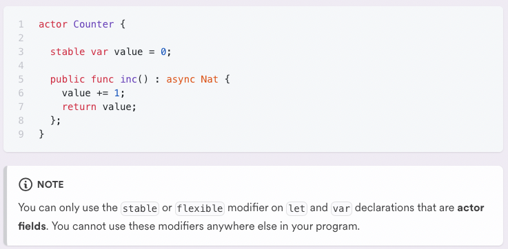
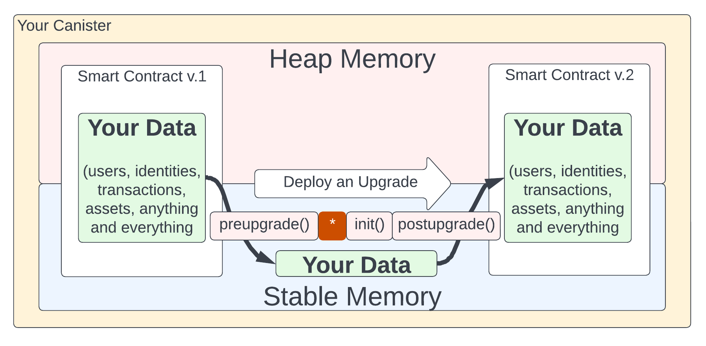

# Day 5
# 🧩 Motoko: Stable variables, system functions & intercanister calls.

##  🆚 Stable Memory vs Heap Memory
- **Heap Memory** <br/>
Heap, as in a “pile of”, memory is space available to programs, or smart-contracts in this case, to allocate and de-allocate as needed all of the time the program (Canister) is running. 

- **Stable Memory** <br/>
Stable Memory, is exactly that, stable. You can create objects that store data in Stable Memory using Stable variables and will survive upgrades. 

In an actor, you can nominate a variable for stable storage (in Internet Computer stable memory) by using the `stable` keyword as a modifier in the variable’s declaration. 

 </p>

## 🔎 Stable Types
One thing that you should also make a mental note of is that stable variables are only possible if the underlying type of the variable is capable of being "stable".

Since not all types are stable, some variables cannot be declared stable. 

> For instance, an object that contains methods (i.e a classe) cannot be stable.

Pay attention to the forums as you might find that the community has re-typed certain variable types that allow them to take advantage of Motoko's stable var feature. (i.e. [StableBuffer](https://github.com/canscale/StableBuffer) which is a remake of the Buffer type allowing it be called stable)

## ✅ Verifying Upgrade Compatibility
The DFINITY CDK, `dfx`, does a wonderful job of verifying whether the new code you will be sending to your canister will damage data or interoperabilty with other canisters or services. 

If you take the time to read the <i>[#ref](https://internetcomputer.org/docs/current/developer-docs/build/cdks/motoko-dfinity/compatibility) </i> document on this subject it will explain a lot, and you may find that at first it does not completely make sense. 

Here are the steps that a deployment using the SDK go through:

  </p>

> As a beginner you can trust the SDK to find errors and issues for you and confirm that you expected it. But understanding why there is an issue and what to do about will be your next step. 

## 🔩 System functions: preupgrade & postupgrade 

Motoko also provides two system functions that will execute at the same moment that you smart contract is being upgraded. It will be important to eventually know what these function can and cannot do so you can include their functionality in your architecture. This diagram as well as the one above should help contextualize this concept a bit.

  </p>

Even if you don't use stable variables or your requirements include non stable data types, you can leverage the Stable Memory your self through the [Experimental Stable Memory](https://internetcomputer.org/docs/current/references/motoko-ref/ExperimentalStableMemory) and/or leverage preupgrade and postupgrade functions available in Motoko


## 📞 Intercanister calls

Communication between canisters that represent different services is central to the vision of the Internet Computer.

Canisters can call other canisters using update calls. <br/>
Let's introduce two canisters:
- **Receiver**
- **Sender**

**Receiver** can receive a message through a public `receive_message` method, store this message in a stable data structure and return the number of messages already received.
```motoko
actor {
    stable var messages : [Text] = [];

    public func receive_message(message : Text) : async Nat {
        messages:= Array.append<Text>(messages, [message]);
        return messages.size();
    };
};
```

Assuming that the canister id of the receiver is `qaa6y-5yaaa-aaaaa-aaafa-cai`, the sender can declare and instantiate an actor which enables the sender to send a message to the receiver through intercanister communication.

```motoko
actor {
    let receiver : actor { receive_message : (Text) -> async Nat } = actor ("qaa6y-5yaaa-aaaaa-aaafa-cai"); 

        public func send_message(message : Text) : async Nat {
            let size = await receiver.receive_message(message);
            return size
        };
}
```

> Try to deploy those 2 canisters locally and observe the delay that appears when a call goes through multiple canisters. Make sure to update the canister id to adapt to your local environment. 

## ⚛️ Atomic execution & commit points
<i> Atomicity is a property of database transactions, which states that a transaction must be treated as a single, indivisible operation that is either completed in its entirety or not executed at all. This means that all of the changes made within a transaction must be committed to the database together, or none of them should be committed. </i>

A canister processes its messages one at a time. If there is no `await` in the body of a function it is guaranteed to execute atomically. <br/> This is useful as it prevents any race condition or unexpected change in the state of the actor. 

```motoko
actor {
    var names : [Text] = ["Lenin", "Elie", "Cedric", "Mathias", "Isaac"];

    public func add_name(name : Text) : async () {
        names:= Array.append<Text>(names; [name]); //We know that the array hasn't been modified during the execution of add_name other than the new name we just added.
    };
}
````
However, whenever you have an `await` expression the state may have changed whenever the execution of the function starts again. 
```motoko
actor { 
    let price : Nat = 10;
    
    public shared ({ caller }) func buy_sandwich() : async Text {
        let balance = await.check_balance(caller);
        if(balance > price){
            let res = await prepare_sandwich();
            switch(res){
                case(#ok){
                    await send_money();
                    return "Here is your sandwich!";
                };
                case(#err){
                    return "Error";
                };
            };
        };

    };
}
```
In this example we sent the money after the sandwich has been prepared - it could be possible that the canister has received another message while awaiting `prepare_sandwich`. Assuming that this other message has modified the balance of the caller. It could be possible that when it is time to run `send.money()` the balance is empty or < price (even though we checked earlier).

> As you can probably imagine whenever the atomicity of a function is not guaranteed it introduced a lot of potential security issues. There will be a dedicated lecture on that topic. 
## 🪤 Trap 
In the context of a canister: a **trap** is a type of error that occurs during the execution of a message and cannot be resolved. The most common causes of traps are:

- Division by zero.
```
let a : Nat = 5;
let b : Nat = 0;
let c = a / b;
```
- Index is out of bounds.
```
let names : [Text] = [];
```
- Assertion failure.
```
assert(false);
```
> Trapping will only stop the execution of the current message and not prevent the canister from answering subsequent requests.

## ⚫️ Commit point
A commit point is a point in the code where you can consider that all previous changes in the current message have been executed and modified the state so that there won't be any rollback.

There are 2 types of commit points:
- `await` expressions
- Returning from a function (either explicitly by returning a value, explicitly by throwing an error, or implicitly by evaluating the last expression).

**Whenever a function traps the state will be reverted to the previous commit point**

## 🪐 X-Subnet
A call to another canister will take around 2sec (1 round of consensus) in the same subnet while it will take around 4sec (2 rounds of consensus) if the canister is in another subnet. 

- If the canister that we are trying to contact is in the same subnet then the message will be processed in the next round. 

- If the canister is another subnet then we need 2 rounds of consensus. We need one round to sign the message & send it to the subnet and one 

# <a id="questions"> 🙋 Questions </a>
1. True or False: we can prevent the heap being erased during upgrades by using a `stable` heap.  
2. **A.call() -> B.call() -> C** 
How much time (or rounds of consensus) do we need to wait for an answer?
3. Is possible to realize an intercanister call in query mode? 

# <a id="useful-resources"> 🔗 Useful resources & links </a> 
- [Stable variables and upgrade methods](https://internetcomputer.org/docs/current/developer-docs/build/cdks/motoko-dfinity/upgrades)

- [Stable Memory](https://internetcomputer.org/docs/current/developer-docs/build/cdks/motoko-dfinity/stablememory)

- [Compatibility](https://internetcomputer.org/docs/current/developer-docs/build/cdks/motoko-dfinity/compatibility)

- [Mutable State](https://internetcomputer.org/docs/current/developer-docs/build/cdks/motoko-dfinity/mutable-state)

- [Experimental Stable Memory](https://internetcomputer.org/docs/current/references/motoko-ref/ExperimentalStableMemory)

- [IC Info Graphic](https://internetcomputer.org/icig.pdf)
