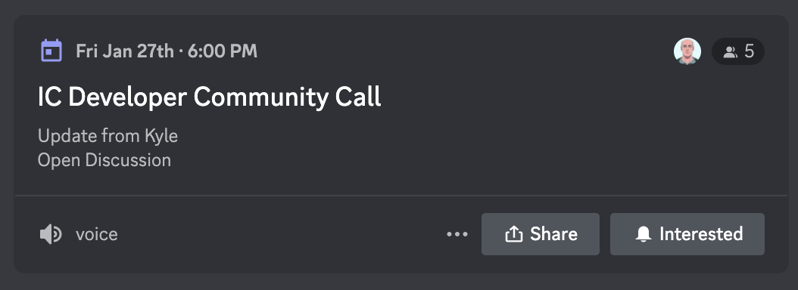
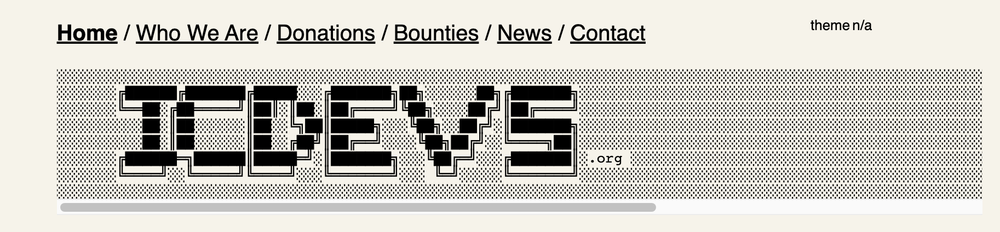
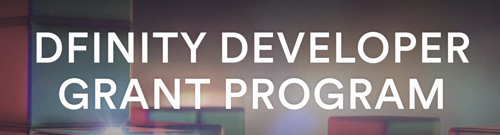

# Day 6
This guide will be the last one for the week! It also will be pretty short - the topics mentionned today are not necessary to complete the core project. 
If you are reading - congrats on making it till the end 🫡

# 🧩 Motoko: Management canister, time & randomness.

## 👨‍💼 Management canister   
The management canister is used on the IC to perform the following operations:
- Create canisters from another canister.
- Install code inside other canisters (that you have control over!).
- Get informations on canister such as:
    - The status of a canister (running, stopping, stopped).
    - A SHA256 hash of the module installed on the canister.
    - The controllers of the canister.
    - The memory size taken by the canister.
    - The cycle balance of the canister.
- Create [ECDSA](https://internetcomputer.org/docs/current/references/ic-interface-spec#ic-sign_with_ecdsa) signatures derived from the canister.
- Create [http_request](https://internetcomputer.org/docs/current/references/ic-interface-spec#ic-sign_with_ecdsa) 
- Interact with [the Bitcoin API](https://internetcomputer.org/docs/current/references/ic-interface-spec#ic-bitcoin-api)
- And way more! 

> The IC management canister doesn't actually exists as a "canister". It doesn't contain a wasm module or memory - it's only an interface to make it easier to communicate with a management API on the IC. The IC management canister address is aaaaa-aa.  

Here is an example of how to use the managament canister inside an other actor.
```motoko
actor {
    let managementCanister = actor {
        create_canister : {} -> async {canister_id : Principal};
        stop_canister : { canister_id : Principal } -> async ();
        delete_canister : { canister_id : Principal } -> async ();
    };

// Create - Stop - Burn 🥲
    public func createStopBurn() : async () {
        let cid = await mangagementCanister.create_canister;
        await IC.stop(cid);
        await IC.delete_canister(cid) 
    };
};
```

Once you've created other canisters from within your canister you can install a wasm module inside of them. This requires that the module is already loaded inside your main canister. This pattern is used by a lot of applications on the IC to create multicanister dApps (OpenChat...)! 
## 🕣 Time
In Motoko you have a **Time** module that is able to return a time value in nanoseconds.
```motoko
import Time 
actor {
    public type Time = Time.Time;
    public func whatTimeIsIt() : async Time.Time {
        Time.now();
    };
};
```
Since the Internet Computer is a distributed system there is no "clear" time for a canister. For instance, the times of different canisters are not related and it would be possible to see a canister time in advance or late compared to another one. However, two things are guaranteed:

- The time within the same canister is always increasing. 
- Within an invocation of entry point, the time is the same. 

## 🎰 Randomness 
Dealing with randomness on the Internet Computer is tricky: all nodes needs to agree on the state of a canister so the randomness needs to be shared between all of them. At the same time, if the randomness can be guessed by any third party it could be disastrous for any dApps that uses it for any type of betting mechanism.

The Internet Computer has solved this issue by providing an API that provides **true randomness** to canister directly from the Random Beacon used in the consensus. You can learn more in this [video](https://www.youtube.com/watch?v=nl5BuiWClD0). 
There is a [dedicated module](https://internetcomputer.org/docs/current/references/motoko-ref/Random) in Motoko that can be used to request **32 bytes of entropy**. 

The entropy is only valid for one round and needs to be refuelled at every round to be considered valid.
```motoko
import Random "mo:base/Random"
actor {
    // Returns 0 or 1 with a 50% probability. Consumes 1 bit of entropy.
    public func tossACoin() : async ?Bool {
        let entropy = await Random.blob();
        var f = Random.Finite(entropy);
        return f.coin();
    };
};
```
# After the Bootcamp?
**Motoko Bootcamp** is only your first step into this amazing ecosystem and I'm hoping that a lot of interesting projects are waiting for you. 
Here a few possibilities for your next steps:

- Join [the developer community](https://discord.gg/m3x86APHyX) on Discord. We have weekly calls on Friday at 6:00 PM UTC+00:00 (London Time) - this a good place to join if you wanna discuss with the communties, discuss ideas or technical issues. It's usually an open discussion and pretty chill :)
<br/>
The calls are organized by [Ted](https://twitter.com/tedreinhardt) - which was also one of your mentor during this camp.

<p align="center"> </p>

- Tackle a bounty to gain more Motoko experience & make some cash!
ICDevs is a community organization that is responsible to assign bounties to work on libraries & tools for the Internet Computer (mainly focused on Motoko but also doing Rust and other languages). There is a lot of work to do so feel free to apply! It's a good way to grab some money and get experience. 

<p align="center"> </p>

- Apply for a grant at DFINITY. You can small smart with a 5K grant and start working on one of your idea! 
The developer grant programm is providing supportto developers that wanna build on the Internet Computer. Feel free to apply - many people are not taking advantage of this opportunity but getting a grant is not that hard when you have the skills! (and you should have them now that you've completed this camp 😎)

<p align="center"> </p>

- Get hired and work in Web3! At Code & State we are launching the first recruiting agency for the Internet Computer ecosystem - more information coming soon. 

- Stay active on social media, join the IC community & share your work, ideas & goals.

Let's f∞cking build & learn! 

## Useful links 🔗
- [Graduation ceremony](https://www.youtube.com/watch?v=arPwp9KZGy8&list=PLeNYxb7vPrkhQN6-ps2krq5Un3xPD3vBQ&index=25)
- [Motoko Bootcamp playlist](https://www.youtube.com/playlist?list=PLeNYxb7vPrkhQN6-ps2krq5Un3xPD3vBQ)
- [Random library](https://internetcomputer.org/docs/current/references/motoko-ref/Random)
- [Time library](https://internetcomputer.org/docs/current/references/motoko-ref/Time)
- [Management canister](https://internetcomputer.org/docs/current/references/ic-interface-spec#ic-management-canister)


